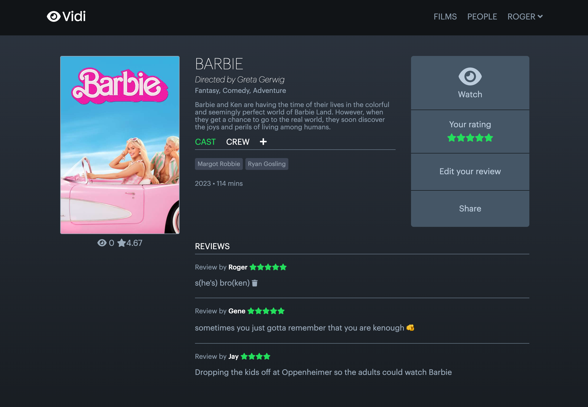
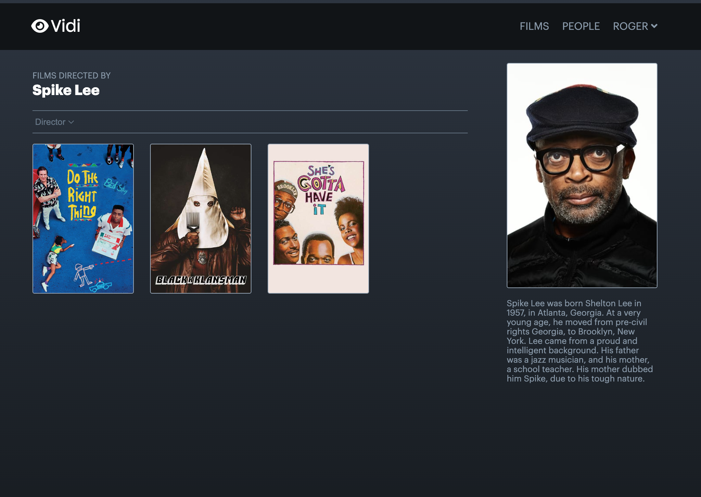

# Vidi

# Description
Vidi is a full-stack web application that allows users to explore and review their favorite films. The application offers a user-friendly interface with login and signup functionality, enabling users to create their personalized accounts and access exclusive features. The site is modeled off of Letterboxd's design.
- Project-URL https://vidi-app.onrender.com/
# Technologies Used
- Frontend:
   - JavaScript
   - HTML
   - CSS
   - React
   - Redux

- Backend:
    - Python
    - Flask
    - AWS
# Key Features
- User Authentication:
   - Users can sign up and log in to their accounts.
   - Authentication is handled using a secure login system that hashes each stored password.

- Films:
   - Users can create, read, update, and delete films.
   - Users can add reviews and add people to films with a respective role.
- People:
    - Users can create, read, update, and delete people.
- Reviews:
    - Users can create, read, and edit reviews.

# Screenshots:

# Creator
Alex Basso
https://www.linkedin.com/in/alexjbasso
